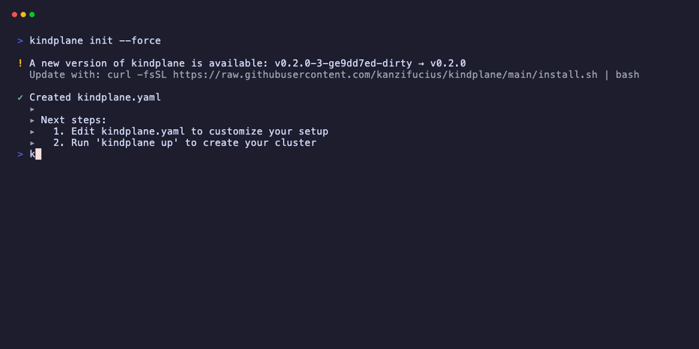
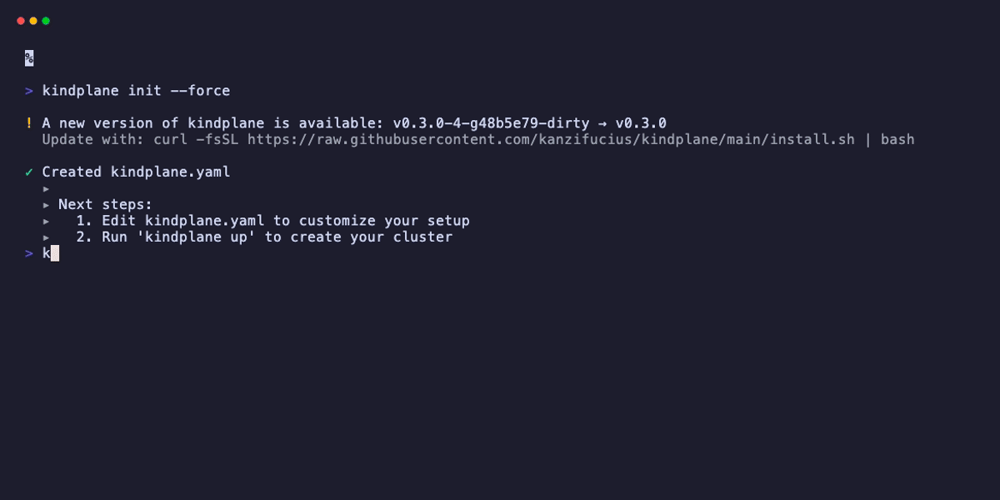

# kindplane config

View and compare kindplane configuration files.

## Usage

```bash
kindplane config <subcommand> [flags]
```

## Subcommands

| Subcommand | Description |
|------------|-------------|
| `show` | Display the current kindplane configuration |
| `diff` | Compare two configuration files |
| `kind` | Output the Kind cluster configuration |

---

## kindplane config show



Display the current kindplane configuration.

### Usage

```bash
kindplane config show [flags]
```

### Flags

| Flag | Short | Description |
|------|-------|-------------|
| `--config` | `-c` | Configuration file (default: `kindplane.yaml`) |

### Description

Displays the parsed and validated configuration file with syntax highlighting.

### Examples

#### Show Current Configuration

```bash
kindplane config show
```

#### Show Specific Configuration

```bash
kindplane config show --config production.yaml
```

### Output

```yaml
cluster:
  name: kindplane-dev
  kubernetesVersion: "1.29.0"
  nodes:
    controlPlane: 1
    workers: 2

crossplane:
  version: "1.15.0"
  providers:
    - name: provider-aws
      package: xpkg.upbound.io/upbound/provider-aws:v1.1.0
```

---

## kindplane config diff



Compare two configuration files.

### Usage

```bash
kindplane config diff <file1> <file2>
```

### Description

Shows the differences between two kindplane configuration files. Useful for comparing environments or reviewing changes.

### Examples

#### Compare Two Configs

```bash
kindplane config diff kindplane.yaml production.yaml
```

#### Compare with Backup

```bash
kindplane config diff kindplane.yaml kindplane.yaml.bak
```

### Output

```diff
--- kindplane.yaml
+++ production.yaml
@@ cluster @@
  name: kindplane-dev
- kubernetesVersion: "1.29.0"
+ kubernetesVersion: "1.28.0"
  nodes:
-   workers: 2
+   workers: 3

@@ crossplane.providers @@
+ - name: provider-gcp
+   package: xpkg.upbound.io/upbound/provider-gcp:v1.0.0
```

---

## kindplane config kind

Output the Kind cluster configuration.

### Usage

```bash
kindplane config kind [flags]
```

### Flags

| Flag | Short | Description |
|------|-------|-------------|
| `--config` | `-c` | kindplane configuration file |
| `--output` | `-o` | Output file (default: stdout) |

### Description

Generates the Kind cluster configuration YAML based on your kindplane configuration. This is useful for:

- Using Kind CLI directly
- Debugging cluster configuration
- Understanding what kindplane creates

### Examples

#### Output to Terminal

```bash
kindplane config kind
```

#### Save to File

```bash
kindplane config kind --output kind-config.yaml
```

#### Use with Kind CLI

```bash
kindplane config kind | kind create cluster --config=-
```

### Output

```yaml
kind: Cluster
apiVersion: kind.x-k8s.io/v1alpha4
name: kindplane-dev
nodes:
  - role: control-plane
    kubeadmConfigPatches:
      - |
        kind: InitConfiguration
        nodeRegistration:
          kubeletExtraArgs:
            node-labels: "ingress-ready=true"
    extraPortMappings:
      - containerPort: 80
        hostPort: 8080
        protocol: TCP
  - role: worker
  - role: worker
```

## Use Cases

### Review Configuration

Before running `kindplane up`:

```bash
# Show what will be created
kindplane config show

# View Kind configuration
kindplane config kind
```

### Compare Environments

```bash
# Compare dev and prod configs
kindplane config diff dev.yaml prod.yaml
```

### Export Kind Config

Use Kind CLI directly for advanced scenarios:

```bash
# Generate Kind config
kindplane config kind --output kind-config.yaml

# Create cluster with Kind
kind create cluster --config kind-config.yaml

# Then install Crossplane manually
helm install crossplane crossplane-stable/crossplane
```

### Debugging

When troubleshooting cluster issues:

```bash
# View full configuration
kindplane config show

# Check Kind configuration
kindplane config kind

# Verify against running cluster
kind get kubeconfig --name kindplane-dev
```

## Related Commands

- [init](init.md) - Create a new configuration file
- [validate](validate.md) - Validate configuration
- [up](up.md) - Create cluster from configuration
